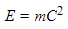

# Titanic & GAN overview
> ### by 栾效阳
> 12.26, 2017

---

### Data mining

---

### [Titanic](./titanic.md)

---

### [Data Mining Process](./data_process.md)

---

### [Data mining platform](./competition_platform.md)

---

### [TensorFlow Speech Recognition Challenge](./tensorflow.html)

---

### Generative Adversarial Networks

---

### [Generative Adversarial Networks](./GAN.html)

---

### Markdown

- Demo

    + [Markdown file](./tensorflow.md)

    + [Html slides file](./tensorflow.html)

    `$ pandoc readme.md -o slides.html -t revealjs -s -V theme=solarized`

- advanced usage
> [如何用Markdown写论文？](http://www.jianshu.com/p/b0ac7ae98100)

    + TeX公式

            $$E = m C^2$$

        渲染效果为

        

    + Footnote

    + Bibliographic citation

---

# 谢谢

