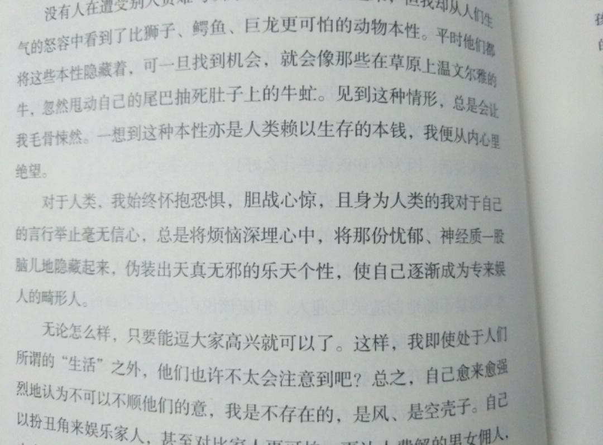
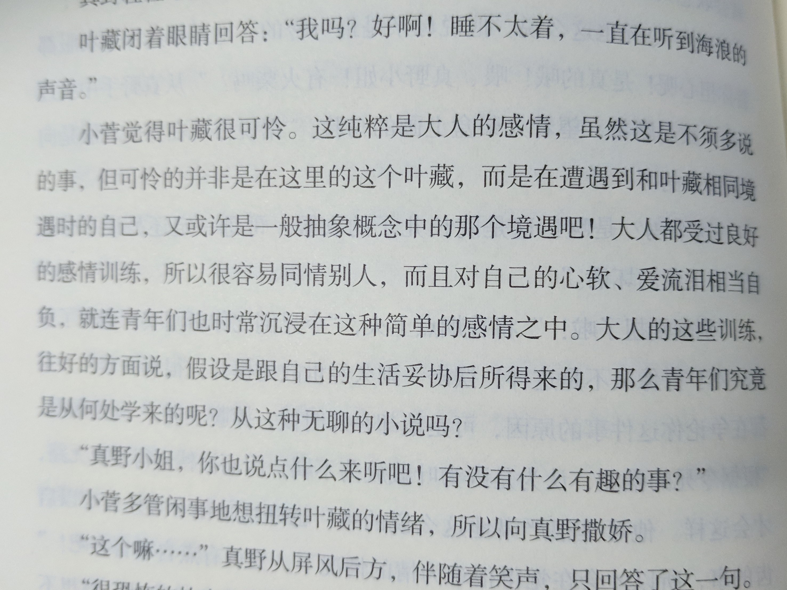
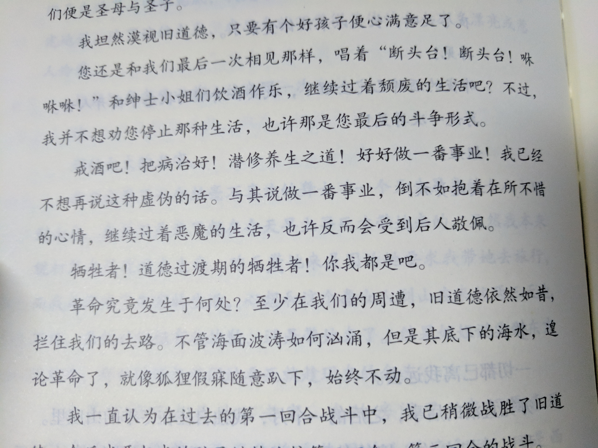
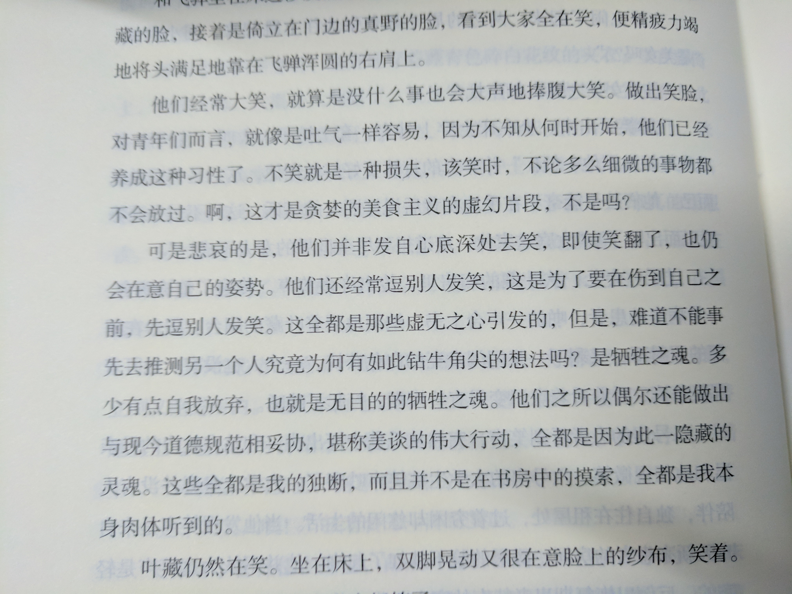
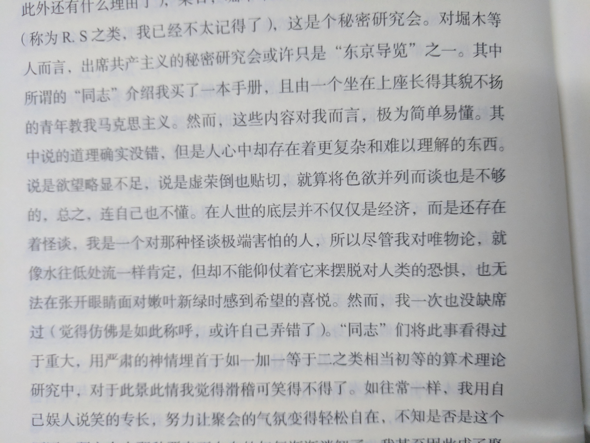

# 《人间失格》
> by 太宰治 from 上海:上海文艺出版社,2014

“面朝大海，春暖花开”，海子写下温暖的诗句，祝福了世人之后，告别了人间。

而 人间失格，即丧失了做人的资格。太宰治本人的经历也是......

除了《人间失格》，书里也包括了《斜阳》、《奔跑吧！美乐斯》、《晚年》、《小丑之花》等作品。

一些基本的想法写在了随笔里，先不再赘述。

对书有所感，近期的心境也不甚明快，以后再来体悟。

***

