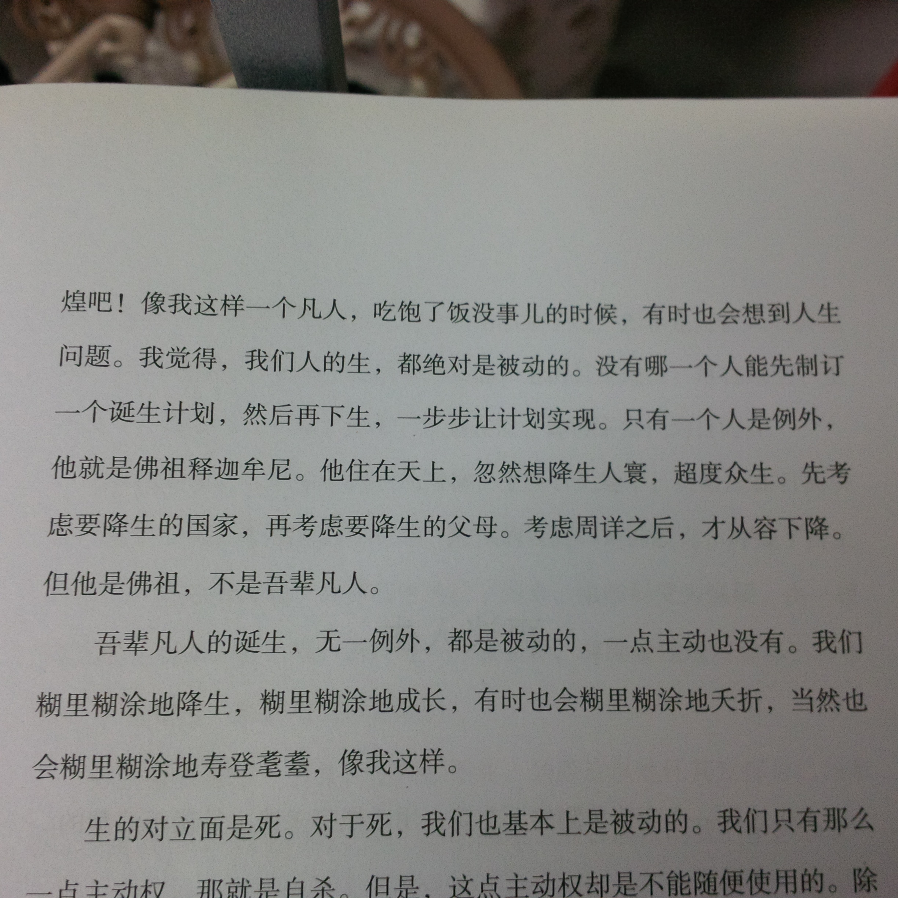
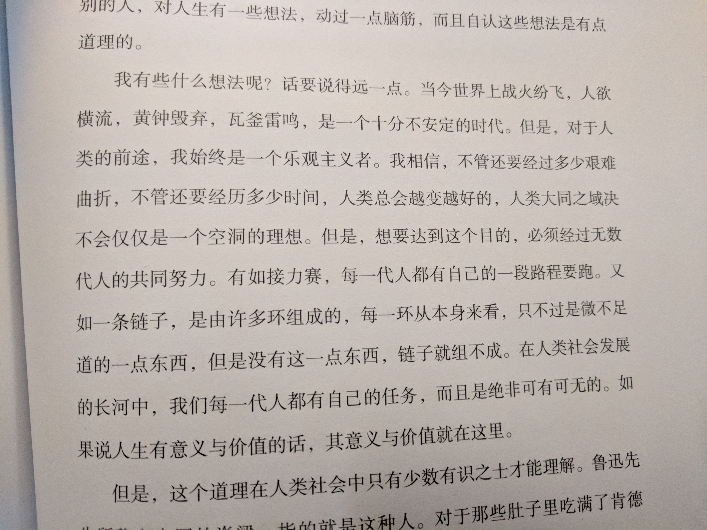
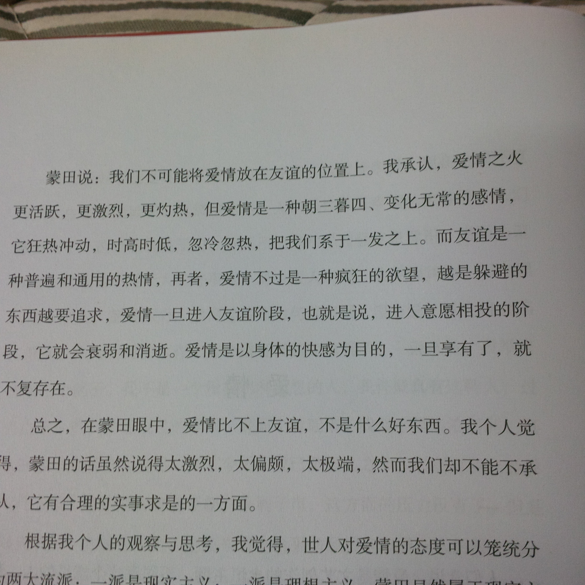
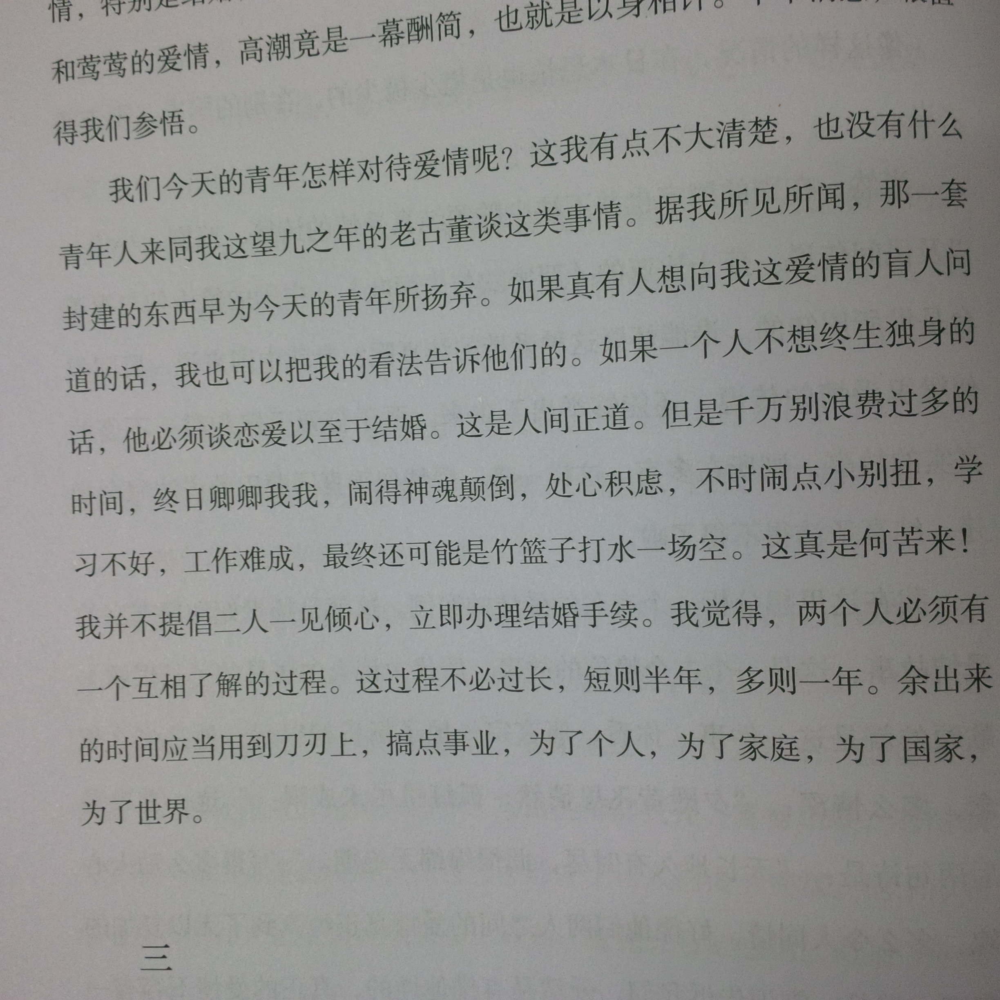
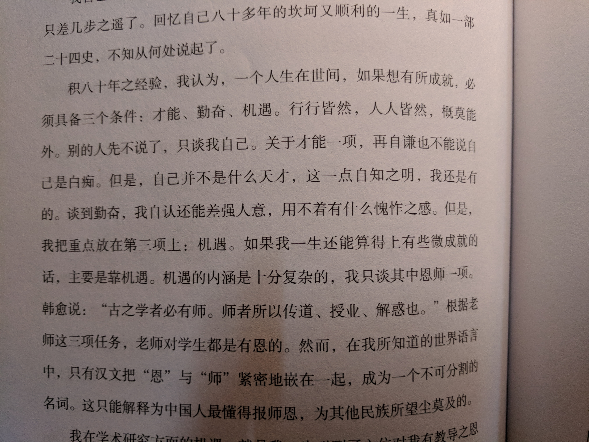

# 《人生小品》
> 青岛:青岛出版社,2015

# 《人生的境界:季羡林谈人生》
> 北京:北京理工大学出版社,2015

对季羡林一直都很有亲切的感觉。书荒，在图书馆闲寻无果，也没找到之前看过的他的书，胡乱拿了这两本“充数”。

另一个角度看，偏向拿了这两本书，难道说明我已经老迈到开始“品读人生”了吗？

心如死水一潭，不起半点波纹，是一种怎样的体验？ :raised_hands: :joy:

