<!-- MarkdownTOC -->

- 论如何正确地擦屁股
    - 擦屁股的方法综述
    - 为什么要擦屁股？
    - 擦屁股的正确方法
    - Q&A
    - 终极大招

<!-- /MarkdownTOC -->

# 论如何正确地擦屁股

### 擦屁股的方法综述

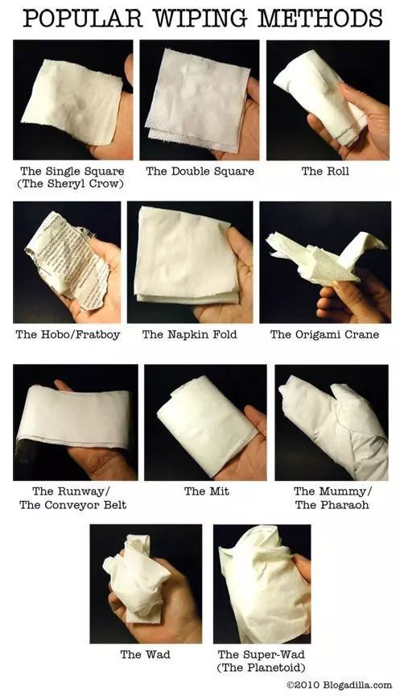

### 为什么要擦屁股？

不合适的擦拭屁股会导致不适，婴儿会哭就是一种证明，同时，还可能导致一些尴尬的健康问题。

首先观赏**形似肛门褶皱的巧克力**

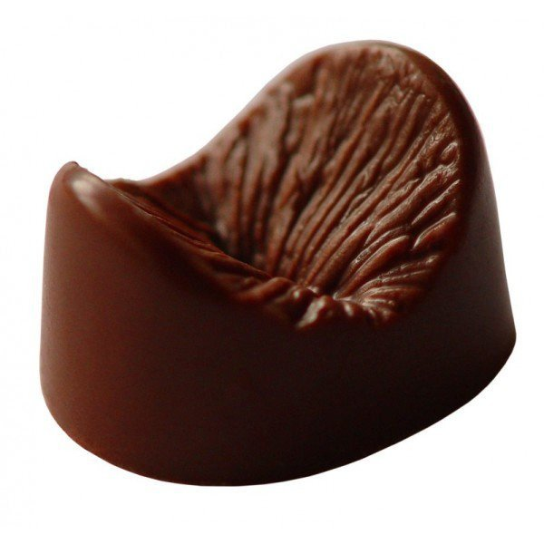

研究证明，擦屁股方式不对是痔疮高发的重要原因

- 肛门处褶皱多，如果没有擦干净，隐匿的细菌长期刺激，引发肛门灼痛;

- 另一方面，不正确的擦法会导致微血管循环不畅，诱发痔疮。

### 擦屁股的正确方法

- ##### 简单粗暴型 “一条道走到黑”

    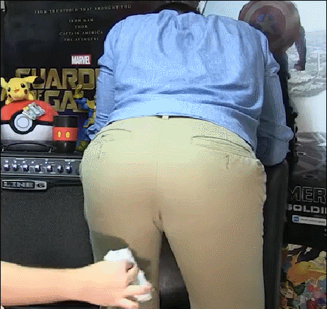

- ##### 吃辣上火适用 “淑女擦嘴”

    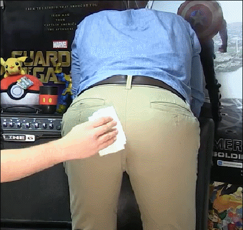

- ##### 强迫症适用 “开心贪吃蛇”

    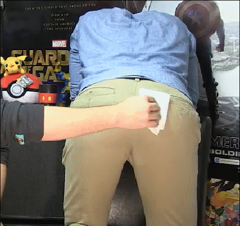

- ##### 一定不能站着擦!!!

    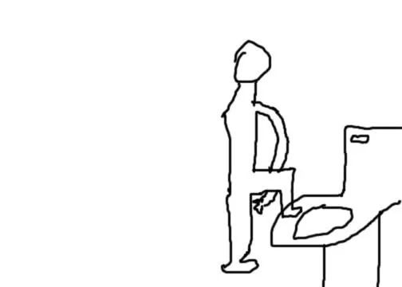
    >站姿状态下，你的屁屁会把菊花包住，更难擦干净啊旁友们。

- ##### 正确姿势!

    象鼻式

    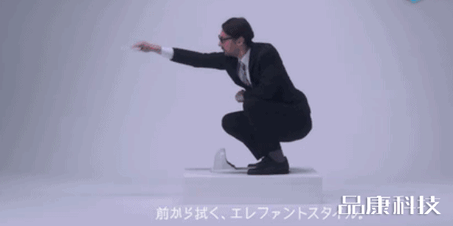

    拍马屁式

    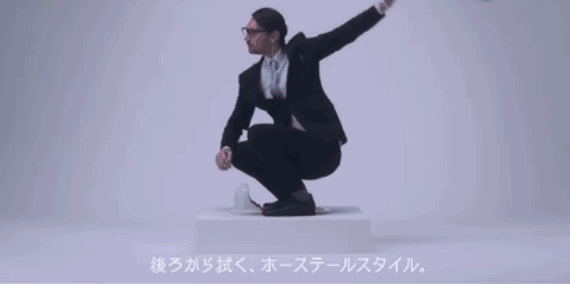

    相扑式 (原图示为冲水马桶洗屁股法)

    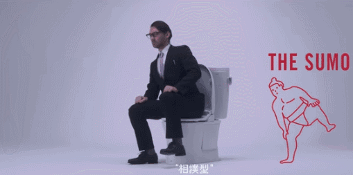

### Q&A

- ##### 擦屁股要全面

    不妨想想你平时是不是习惯用同一个手擦屁股？

    从今天起，请两个手轮流上阵。肛门处的褶皱很难擦拭，你可能长久以来只擦了一边。

- ##### 擦拭方向有讲究

    如果你是男性，那恭喜你，任你来去自由，想从前往后还是从后往前都没关系。

    但如果是女性，最好从前往后擦，这可以降低你得泌尿系感染得风险，即使没有排便，肛门处也存在一些细菌会被擦到前面，一些肠道正常菌对尿道来说就不友好了。

- ##### 擦拭力度很关键

    擦拭力度也很重要，需要一些压力，但又不能太用力。清洁干净很重要，但是过度的擦拭反而更糟。

    太用力的擦拭会刺激肛门，可能导致肛门出血或直肠出血，因过度用力擦拭导致微伤口的情况并不少见。

- ##### 用湿巾会比较好吗?

    + **湿巾的 pH 值偏高或偏低，在使用过程中可能对人体健康带来一些危害。**

    + **湿巾可提供微生物繁殖理想的环境，包括合适的酸碱环境、温度、水及营养等，所以非常容易滋生细菌。**

### 终极大招

**坐浴是最佳选择!**

如果有条件，水洗、坐浴无疑是最好的方式。坐浴减少了手和粪便之间的接触，使得一些致病菌，如大肠杆菌，的传播几率降低。同时，坐浴对于有腹泻或其它肛周问题的人也很友好，坐浴不仅能清洁肛门、促进术后创面愈合、还能防感染、消肿止痛。

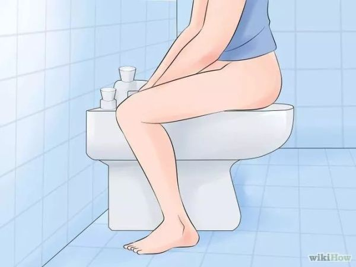

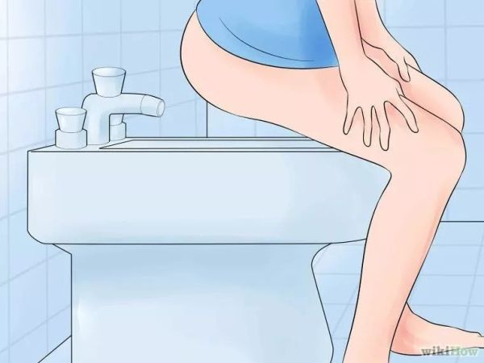
> 欧美净身器（bidet）注：不是洗脚的！不是洗衣服的！不是洗拖把的！

也因此，人们对于智能马桶的需求正在上升，这一点日本人最有发言权，她们对于马桶有种近乎变态的执念，**全新的高科技的日本马桶使你可以直接通过手机就完成一切操作，冲水、坐浴、烘干、盖盖子。你唯一要自己动手的，就是脱裤子，好好享受。**

[source](https://daily.zhihu.com/story/9673541)
